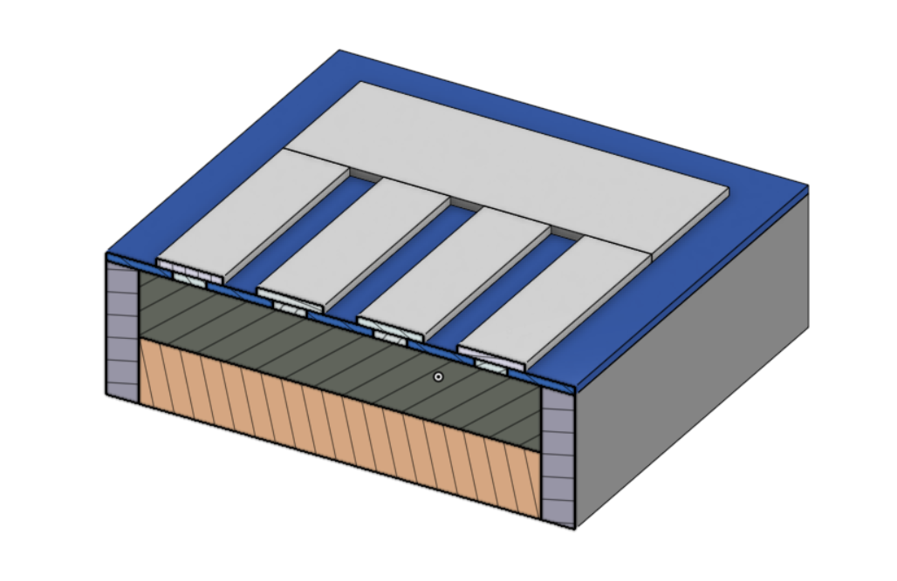
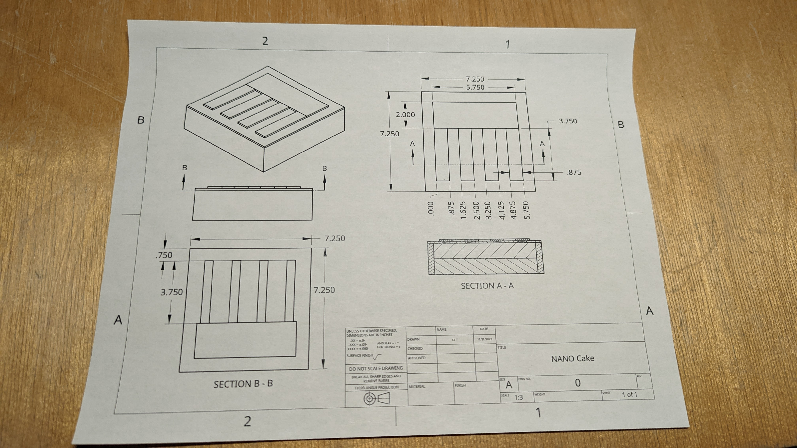
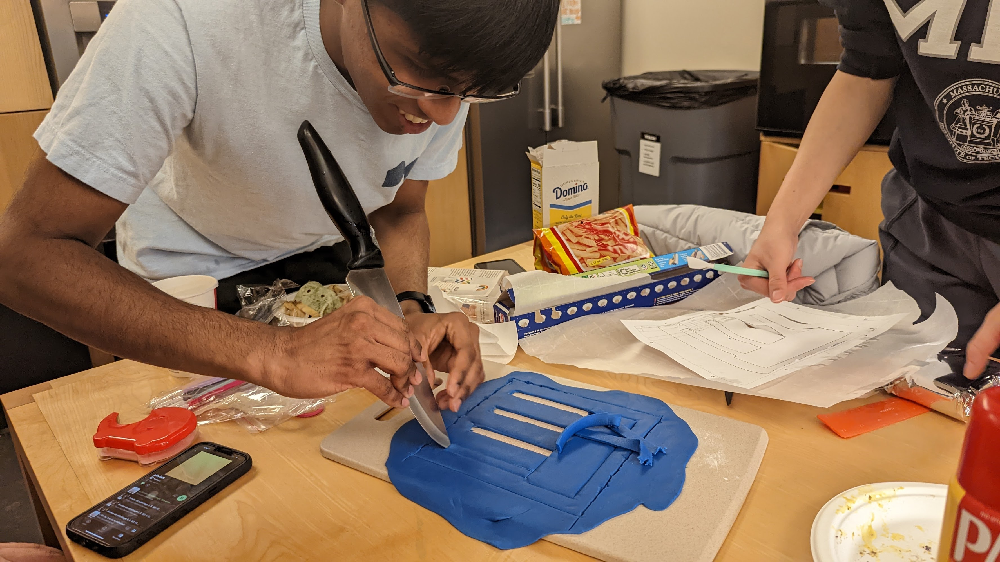
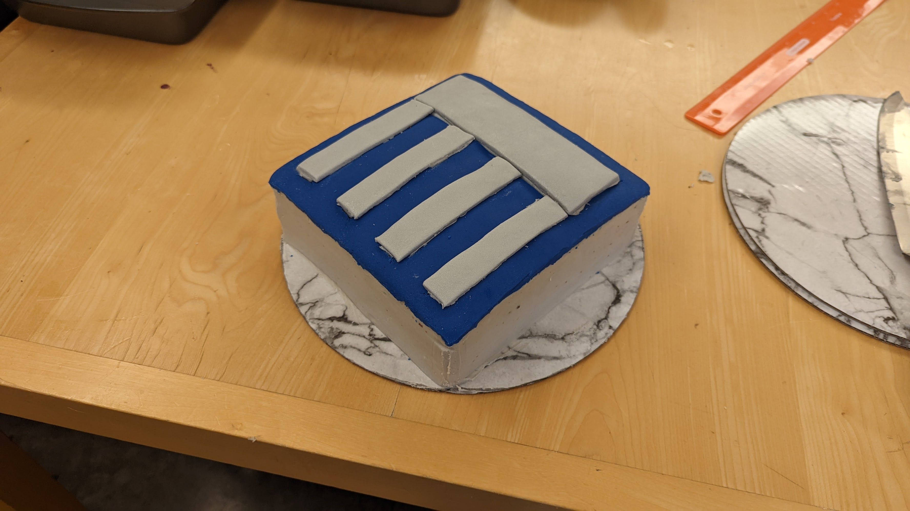

## Step 1: CAD
The cake is for my roommate Claudius's MIT Nano advising seminar, so we designed it to look like a solar cell. 
Solar cells have the following layers, ordered from top to bottom:
 - Aluminum grid for electrical contacts
 - Dark blue Silicon Nitride to minimize reflected light
 - n-type silicon layer
 - p-type silicon layer
These features are all included in our CAD model. 

We made drawings for precision cake manufacturing.

## Step 2: Precision Manufacturing
The difference between baking a cake and *engineering* a cake is precision. We printed out 1:1 drawings and carefully cut out fondant to the 0.001" spec. We would have used a waterjet, but manual cutting gives us a nicer finish.

We used a square foamboard template to precisely cut and frost the cake. 

The brown layer is n-type silicon and the yellow layer is p-type.

We applied silicon substrate (buttercream) on the faces using a foamboard stencil.

Two coats gave us a nice, smooth finish.

Finally, we used buttercream to attach the silicon nitride and electrical contacts on top of the solar cell.

We were very happy with how the final cake turned out. It only took us until 4 am to finish.

