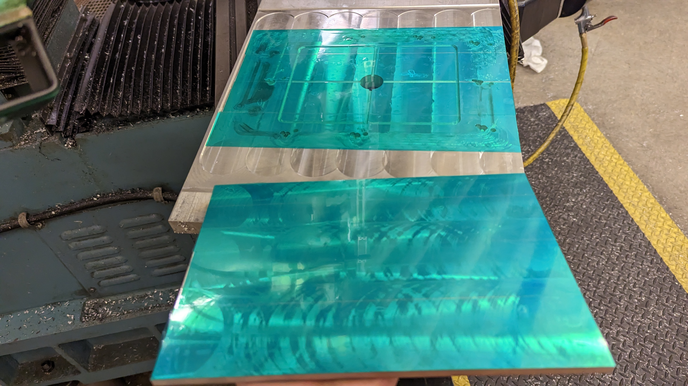
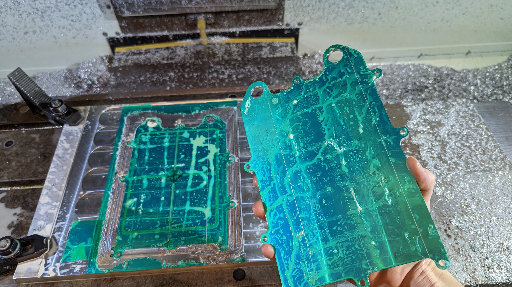
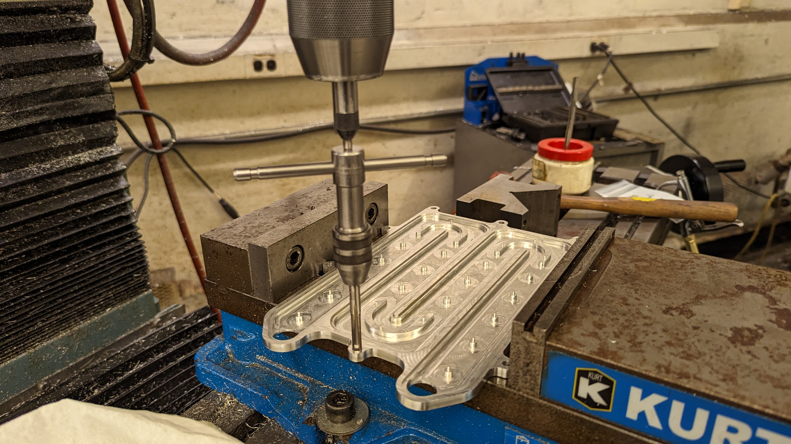
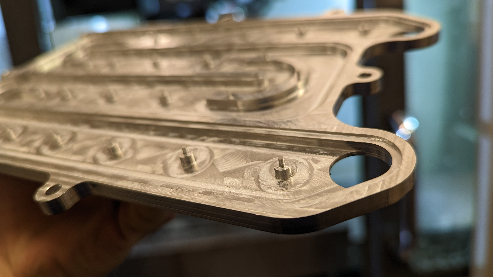
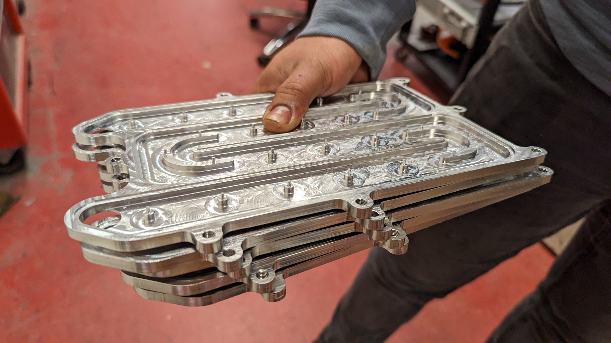
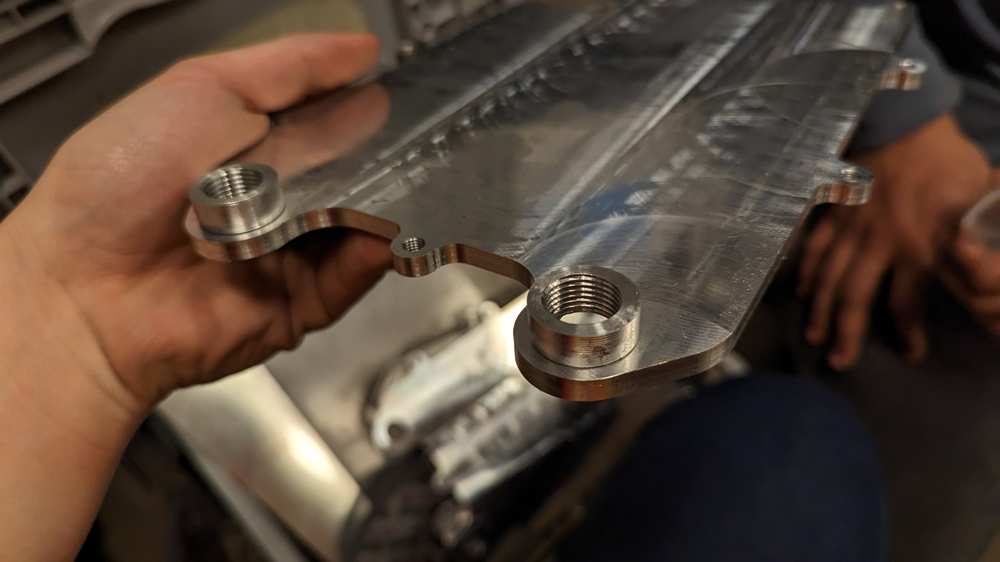
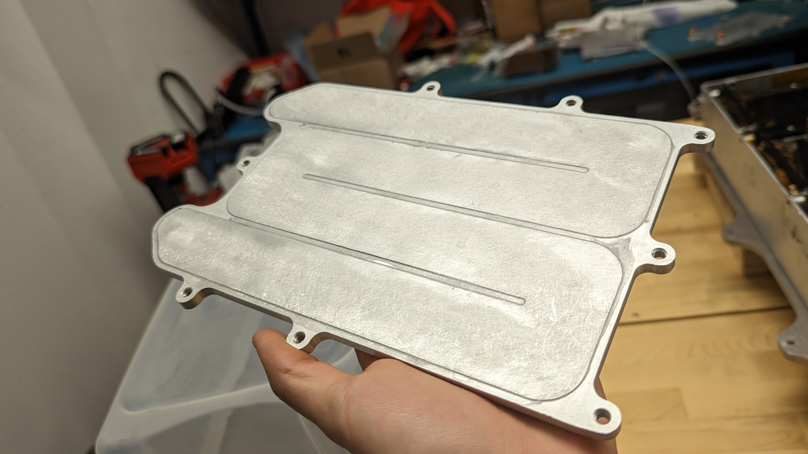
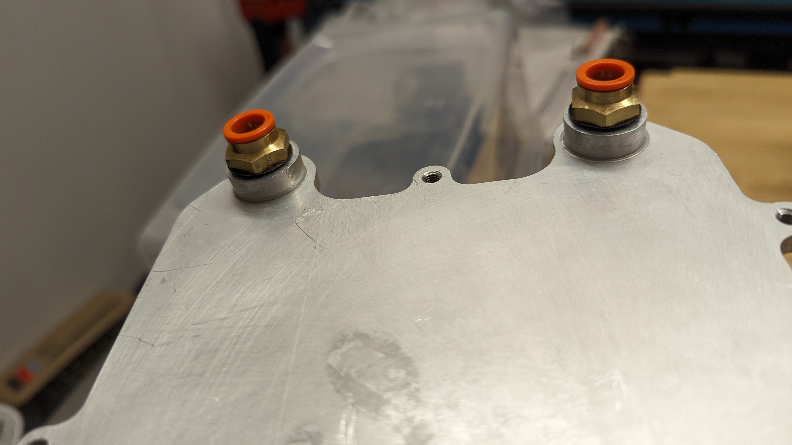
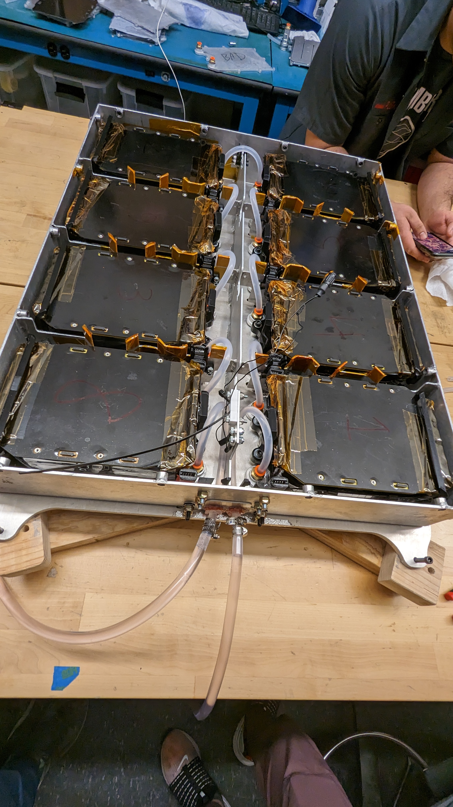

I machined four coldplates for MIT Motorsports. Coldplates are aluminum parts that have channels for cold water to pass through. The coldplates I made were for the battery. We make them in multiple parts and have them brazed so that they are watertight. 

[Dip Brazing](https://www.dipbraze.com/what-is-dip-brazing/) is a process where you cover a joint with a molten filler metal and let it harden to form a watertight bond between them. The last time we tried making cold plates, they couldn't be brazed properly because we used 7075 aluminum alloy, which has [too low of a melting point to be brazed effectively](https://www.mtm-inc.com/brazing-aluminum.html). This time we are using 6061 aluminum.

First we faced the stock so that it would be flat on the bottom. We used a vacuum plate for this but decided against using it for the actual machining because it was getting shifted. 



Then we applied tape to the faced side of the stock as well as a larger piece of stock (which was also faced) and superglued the tape together.

Next we clamped the larger stock to the Haas with toe clamps and used a dial indicator to make sure the stock was straight.

We probed the stock to find its center.


We found the bottom height of the stock by probing off of two layers of tape. The two layers of tape matches the height of the base of the stock we are machining.

Once everything was set up, we ran the gcode. At first, we got really big burrs. The endmill was dull, so it was pushing the metal up instead of cutting it. So we replaced the endmill and ran the program again. 

The entire operation was an hour and a half of runtime so we only recorded the coolest parts. In this video it drills the holes super quickly.


We removed the plate from the larger stock using a chisel and hammer. The tape can be peeled off easily, leaving nothing behind on the part.


We tapped the holes using a spring-loaded tool in the manual mill which keeps the tap straight and applies downward pressure.

The parts came out pretty nicely.

We made four coldplates in total.

The water will come in through connectors that are threaded into these cylindrical parts that will be brazed to the coldplate.

This is what they looked like after being brazed.

The inside of the battery looks like this. Water is cooled by radiators and pumped through the tubes which lead to channels inside the coldplates underneath the battery modules. 
