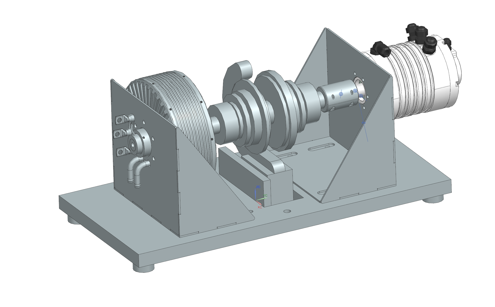
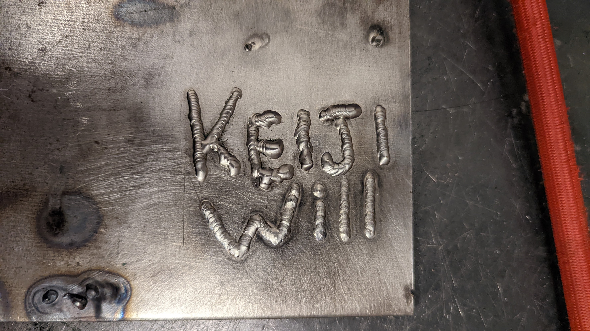
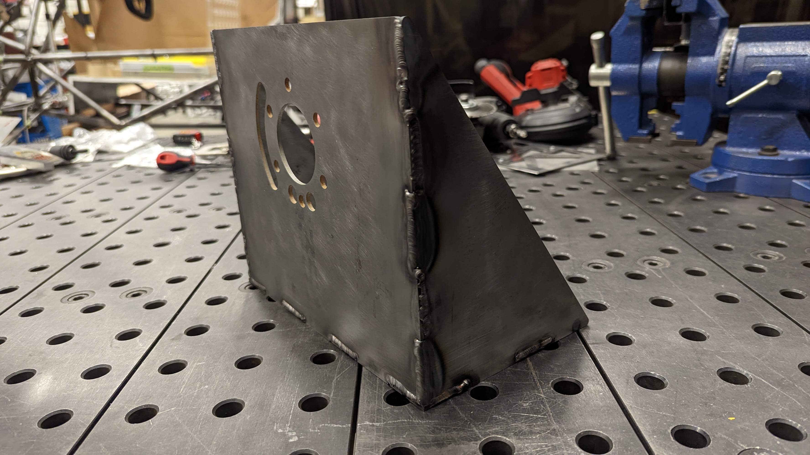

[MIT Motorsports](https://fsae.mit.edu/) builds a formula-one-style racecar every year to compete in [FSAE](https://en.wikipedia.org/wiki/Formula_SAE). One of the big goals for MIT Motorsports this year is moving to four-wheel drive. We developed our own custom gearbox and inverter. To get the power and efficiency curves of the Hawk40 motor in combination with our custom inverter and gearbox, four new members and I are building a dynamometer. 

I learned how to use NX, an industrial software that is powerful but unintuitive. Here's a screenshot of the motor mounts I CADed:

We used the waterjet to cut the plates out of 1/8" steel.

Then I learned how to weld. Welding is kind of like soldering, but if you accidentally let the tip touch metal, it gets stuck and you can end up with something like this:

I added my name to the welding plate but as you can see I messed up the E. It's supposed to look like dimes stacked on each other.

Here's the jig we used to ensure that the mounting plate is square. This is very important because we need the two dyno motors to be as close to concentric as possible. After we had the plates secured, we welded tacks on the inside to connect the parts before doing the larger welds.

After practicing welding for a few days I was confident enough to weld the mounting plates together.

We are also working on building a dyno using old parts from a previous dyno project. Here's my pathetic attempt to exert torque on the wireless torque sensor. 
