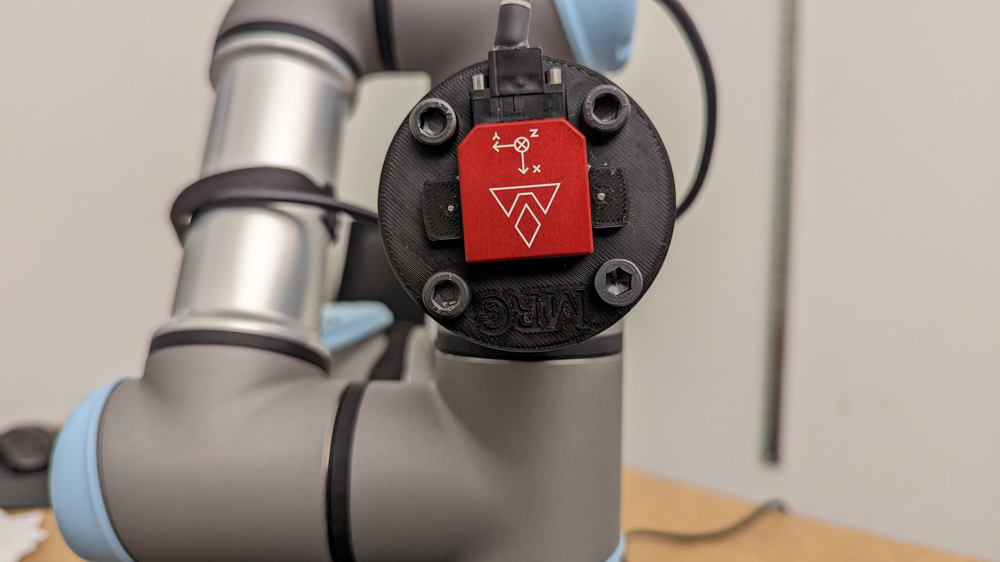

I did a UROP (undergraduate research) at the MIT Marine Robotics Group. I'm trying to reduce drift for Inertial Measurement Units (IMUs) commonly used in underwater robots. My plan is to attach research-grade IMUs to a six-axis arm and simulate random robot movement. By comparing where the arm thinks it is with where the IMU thinks it is, I can train a machine learning model to reduce error in the IMUs.

These are the IMUs I am using.

This is my 6-axis robot, who I've named Armin.

I installed Ubuntu 18.04 on a laptop and setup ROS melodic and MoveIt to control the arm. In this video I use rvis to move the arm around. Sometimes it generates twisty paths to avoid [singularities](https://www.mecademic.com/en/what-are-singularities-in-a-six-axis-robot-arm).


I sent the data from the Vectornav 100S IMU to rvis with this [vectornav driver](https://github.com/dawonn/vectornav) and [imu_tools](https://github.com/CCNYRoboticsLab/imu_tools). The Vectornav 100 series doesn't have built-in odometry so I will have to use another package to handle that.

I mounted the IMU to the arm using a 3D printed part and velcro straps for wire management.

I wrote a script that makes the arm move in a spiral trajectory so that we could collect acceleration data on the IMU. 



