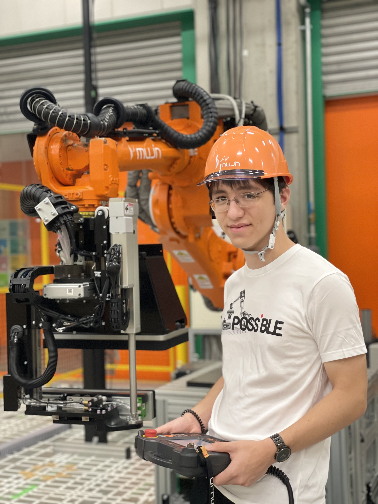
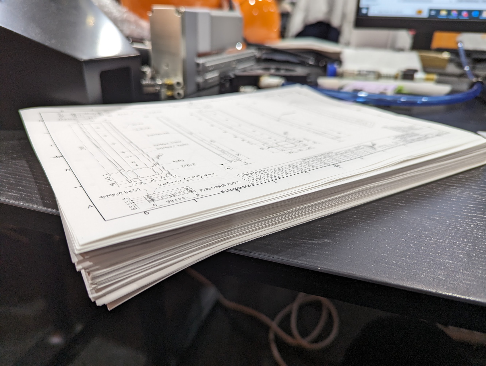
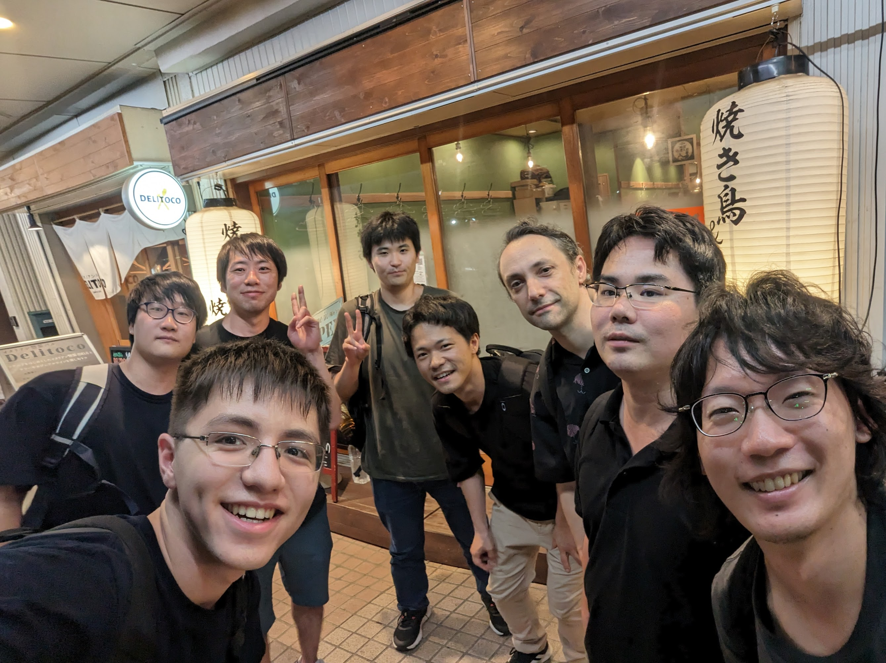
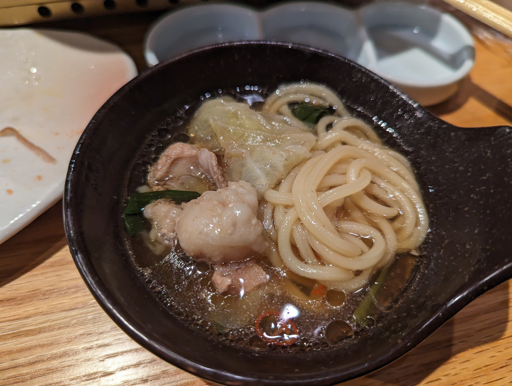

I was a design team intern at Mujin the summer of 2023. In just three months, I've been convinced that Mujin is one of the top 3 coolest robotics companies in the world. The internship was in Tokyo, Japan, but (almost) everyone in the company speaks English.

I summarize my internship experience in this interview:


Mujin's robots automate warehouses and factories, allowing humans to do more meaningful work. 

Mujin can automate a huge range of tasks, including [unloading trucks](https://www.youtube.com/watch?v=9oB6fnZ7N6w), [sorting automotive parts](https://www.youtube.com/watch?v=28S1gxOLw0U), [picking gears](https://www.youtube.com/watch?v=h5c2i4Ophsw), [sorting groceries](https://www.youtube.com/watch?v=qap0OXyDMTU), [sorting medicine](https://www.youtube.com/watch?v=Lf-iTcULJI8), and much more.

While most competitors rely on deep learning for path planning, Mujin uses mathematical algorithms built into the "Mujin Controller" that allow the company to branch out to so many applications while maintaining extremely high reliability.

Here's a video showing off a small sample of Mujin's capabilities:



I primarily worked on the manipulator of the first robot shown - the "L-shaped gripper". 

My responsibility was making this gripper crash-proof. Although Mujin's robots crash extremely rarely, it's really bad when they do. The production lines they are used in can make thousands of dollars per minute, so downtime is super expensive. When you include costs of sending a repair team immediately and the replacement mechanism, it becomes clear that if my damper only has to work once in production to pay itself off (and my internship).

Unfortunately I am not able to share technical details or photos of my project.

I started by carefully watching the videos and reading the documentation of all the accidents that this gripper has been involved in. I used these to form design requirements for a damper that would prevent damage in almost all scenarios. 

I designed the damper, and after two design reviews I made drawings which were sent out within the first month of my internship. While waiting for the parts to arrive, I redesigned the rest of the gripper, removing an unnecessary mechanism and making parts lighter and more compact.

I made assembly drawings and built the gripper with help from the manufacturing team. Once it was in good shape, I ran a series of increasingly aggressive tests to optimize adjustable parameters and verify that my mechanism met design requirements.

The damper passed the tests exactly as expected and is ready for production.

By the end of my internship, I had made a ridiculous number of drawings:

In addition to the engineering, I really enjoyed the culture of Mujin. Whenever I had a question, my mentor would go out of their way to answer to the best of their ability. People on other teams were extremely supportive and helped me tremendously.

Perhaps most importantly, we had great social events.

In addition to being a legendary programmer, the CTO, Rosen, is naturally a Starcraft 2 god. His viking + battleship army somehow annhilated my broodlords.

We had monthly team dinners where we got to know each other better and enjoyed delicious Japanese food.

