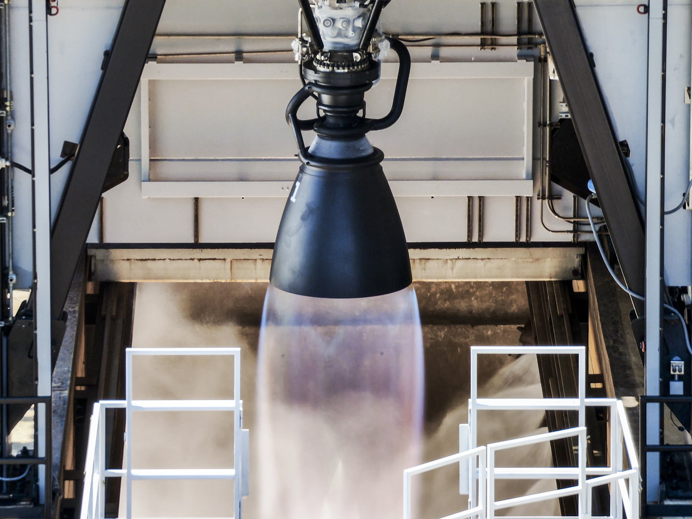
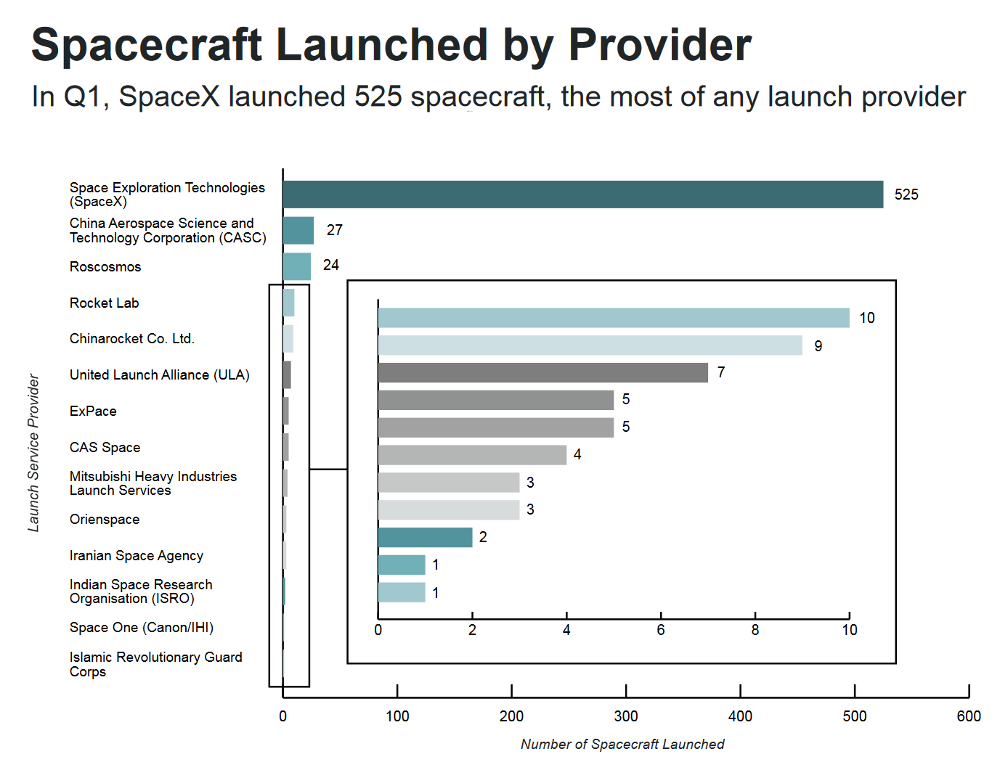
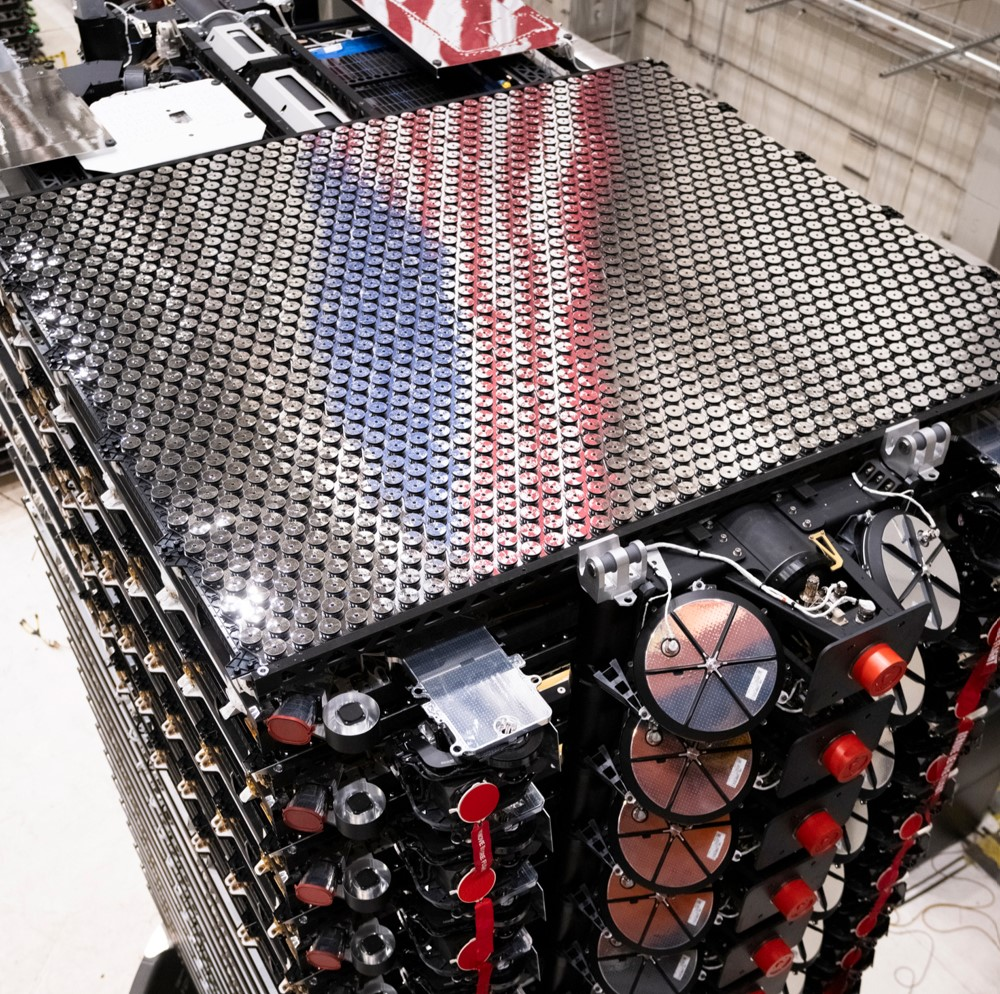

Last summer, I had the opportunity to intern at SpaceX, which is in my opinion the coolest company in the world. I worked on a Starshield team, which does government and defense satellites, so I can't talk about any specifics of my internship. So instead I'd like to focus on why SpaceX is such an incredible company and what I learned from this internship.

## What I learned

As a sort of final project of my internship, I designed a custom PCB fastener for a Starshield satellite. I determined the design criteria including board strain, TIM strain, gasket compression, tolerances, structural loading, and RF packaging requirements. I analyzed my fastener arrangement in FEMAP, determined the boundary conditions and sized for shipping and ascent, orbit, and connector installation. I analyzed many fastener arrangements and radiator stiffnesses to justify my design. Additionally, I analyzed the axial and lateral tolerance stackups, accounting for the worst case CTE mismatches across hot and cold cases, swept across time and beta angle. I presented a design criteria review and preliminary design review, then handed off my work to the Starshield team. While working at SpaceX I learned how to analyze bolted joints, fatigue analysis using NASGRO, tolerance stackups with thermal loading, and dynamic loading, which generally helped me understand what truly rigorous mechanical engineering looks like.

More generally, I had two major takeways:
- ask experienced people for advice on direction (what to work on, what approach to take, etc) rather than technical support
- if you can answer the key questions with physical testing, you should.

## Why SpaceX is even cooler than I imagined

### Rockets

This stuff is just so inspiring and unbelievable.







It sounds insane, but I actually believe SpaceX will build a self-sustaining civilization on Mars within our lifetimes, given the rate of progress that they've been making.



Don't even get me started on Raptor.

Just look at the visual difference between the Raptor 3 and the next best rocket engine out there. Stoke space is the only other company with a full flow staged combustion engine, which is the [holy grail of rocket engine architectures](https://youtu.be/LbH1ZDImaI8).

### Starlink

I think people generally don't realize how revolutionary of a technology Starlink is. I think it's more likely than not that in our lifetimes, almost all internet will be broadcasted from space. There's a reason that the majority of SpaceX's launches have been exclusively launching starlink satellites. The biggest payoff in the short term for Falcon 9 and reusable rocket technology is making enormous satellite networks like Starlink possible.

There are currently almost 7,000 starlink satellites in orbit. You can see them here: https://satellitemap.space/?constellation=starlink#

These are the summary of global orbital space launches in Q1 of 2024, as [reported](https://brycetech.com/reports/report-documents/Bryce_Briefing_2024_Q1.pdf) by Bryce Tech. In 14 weeks, SpaceX had 31 launches and put 525 spacecraft into orbit.  This is more than an order of magnitude higher than China and Russia's space programs put together! It's hard to grasp how dominant SpaceX is.

That's more than two rocket launches and 40 satellites per week! How can you manufacture 40 satellites (each costing millions of dollars) and 2 rockets ($70 million per launch) every week, where the slightest quality control defect can result in complete mission failure? 

SpaceX had their [first mission failure](https://www.space.com/spacex-finds-cause-falcon-9-rocket-failure) since June 2015 in July 11, 2024. The engineering rigor needed to see these levels of reliability and performance is simply absurd.

#### V2 Mini

The satellites have been designed to stack tightly to pack a ton of satellites in a rocket, while deploying their two massive dual axis solar arrays and electronics on orbit. The satellites are extremely lightweight and compact as a result.

#### Direct-to-Cell

### Phased Arrays

SpaceX provides internet to users through *phased arrays*. These are PCBs with evenly spaced antennae elements that are fired in a precise sequence to generate a RF beam that can be steered with mind-breaking precision. This allows a satellite the size of a car orbiting at 18,000 mph trying to communicate with a laptop-sized PCB mounted to someone's roof or a boat in the middle of the Pacific. Here are some cool visuals of phased arrays from [wikipedia](https://en.wikipedia.org/wiki/Phased_array):

<iframe width="560" height="315" src="https://upload.wikimedia.org/wikipedia/commons/transcoded/8/80/Phase_array_sweep.webm/Phase_array_sweep.webm.480p.vp9.webm
" frameborder="0" allowfullscreen></iframe>

### Deploy Footage

<blockquote class="twitter-tweet" data-media-max-width="1920">
Video of last night’s <a href="https://twitter.com/Starlink?ref_src=twsrc%5Etfw">@Starlink</a> satellite deployment <a href="https://t.co/K7ezZLLusz">pic.twitter.com/K7ezZLLusz</a>
&mdash; SpaceX (@SpaceX) <a href="https://twitter.com/SpaceX/status/1703132464712237216?ref_src=twsrc%5Etfw">September 16, 2023</a></blockquote> 

<blockquote class="twitter-tweet" data-media-max-width="1920">
First Starlink v2 satellites reach orbit <a href="https://t.co/0l08568mJ9">pic.twitter.com/0l08568mJ9</a>
&mdash; Elon Musk (@elonmusk) <a href="https://twitter.com/elonmusk/status/1630394434847227909?ref_src=twsrc%5Etfw">February 28, 2023</a></blockquote> 

