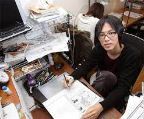
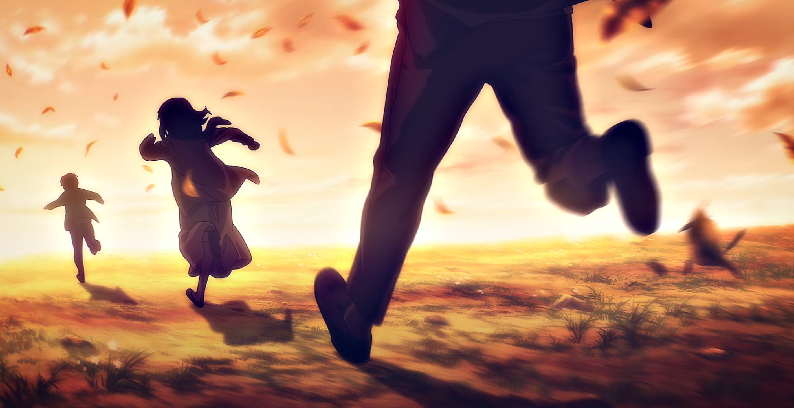

After watching the final episode of Attack on Titan, I felt deeply moved and grateful. This blog post is my way of showing my appreciation for everyone who helped create this masterpiece.

## Intro

I have been lucky enough to experience a couple things that were so wonderful it changed how I view the world.

One of those experiences was a sushi restaurant in Japan.

We had found a small sushi place that had four stars on google maps. We sat on the bar and the chef made each piece of sushi one at a time and handed them over the counter.



I didn't know it was possible for food to taste so good. Every bite was heaven. If I could further emphasize how good this sushi was, I would. 

Ever since, I can't help but feel scammed whenever I eat out. Nothing I've ever eaten has come close to that sushi.

Attack on Titan was another one of those once-in-a-lifetime experiences. As much as I love Game of Thrones, Star Wars, Ender's Game, and Lord of the Rings, Attack on Titan is on a different level.

Attack on Titan has deeply changed my understanding of war, human nature, and storytelling.

I'll try to persuade you to watch Attack on Titan by highlighting it's music, art, characters, plot, and finally I'll explain how watching Attack on Titan made me a better person. I promise I won't spoil anything.

## Music

I'll start with this so that you can listen to the soundtrack while reading.

### Soundtrack

Attack on Titan's soundtrack goes so hard.

Here's a playlist of my favorites.
<iframe style="border-radius:12px" src="https://open.spotify.com/embed/playlist/2FmMhggKVcENQkG62EJvy4?utm_source=generator" width="100%" height="352" frameBorder="0" allowfullscreen="" allow="autoplay; clipboard-write; encrypted-media; fullscreen; picture-in-picture" loading="lazy"></iframe>

They go above and beyond with a full orchestra and german vocals.



These songs will hit even harder once you watch the incredible scenes they are used in. Nostalgia shoots through my veins whenever I listen to Tooth-I or T-Kt.

### Intros and Outros

Attack on Titan also commissions unique intro and outro songs from famous Japanese bands for every season. These intros are combined with awesome animations that will get you hyped for the episode. My favorite is Red Swan.

<iframe style="border-radius:12px" src="https://open.spotify.com/embed/playlist/3JjKwDOv6DO6pENA3dYMl2?utm_source=generator" width="100%" height="152" frameBorder="0" allowfullscreen="" allow="autoplay; clipboard-write; encrypted-media; fullscreen; picture-in-picture" loading="lazy"></iframe>

## Art

### Manga

The Attack on Titan manga was written and illustrated all by one person, Hajime Isayama. He started working on Attack on Titan when he was 19.

The following is one of the 33,000 hand-drawn manga panels. 

Attack on Titan is not like some books and TV series which are mass-produced to make as much money as possible. This is Isayama's life's work.

### Animation

The best animation studios in the world (WIT and MAPPA) worked with Isayama to create an anime that takes the manga to a different level.

Here are a few shots that I like. I love how they draw people's eyes (see the gallery in the next section) and the clouds.



### Action

They have this technology called ODM Gear which is like [Titanfall 2 grapples](https://www.youtube.com/watch?v=U5lQGBl9rzg) on steroids. This, combined with epic titan-on-titan fights (choreographed with the help of [professional martial artists](https://www.youtube.com/watch?v=xDD4FBDHwSE)), make Attack on Titan fight scenes truly incredible. 

<a href="https://tenor.com/view/aot-levi-attack-on-titan-levi-ackerman-odm-gear-gif-25313040">Aot Levi GIF</a>from <a href="https://tenor.com/search/aot-gifs">Aot GIFs</a>
 

## Characters

Attack on Titan shows you war through the eyes of soldiers, civilians, oppressors and the oppressed. But instead of showing you "good guys" and "bad guys," the characters are written like real, relatable people. As the story unfolds, you begin to understand the life and hopes and dreams of every character. Seeing the perspective of these incredibly well written characters helps you understand why people go to war and do terrible things. 

The art and voice acting really convey the emotions of the characters. Here are some shots of my favorite characters.



If you watch the first episode you'll see the incredible voice acting I'm talking about.

## Plot

### Premise

The premise of Attack on Titan is that all of humanity is confined inside big walls, and there are man-eating giants, called titans, outside of the walls.

I leave it at that because it's better if you learn the rest by watching the first episode yourself.

### World Building

Every detail of the world of Attack on Titan has been thought out and will eventually be explained. As the main characters learn more and more about the world, you will be continually shocked by how deep the Attack on Titan world really is.

### Plot Twists

Attack on Titan has plot twists that will leave you in pure disbelief. They will change your understanding of the whole story and the tension leading up to them will have you at the edge of your seat.

The foreshadowing is crazy. Isayama couldn't have written the first chapter of Attack on Titan without knowing how the whole story ended. Every major plot twist has been hinted at from the very first episode.

### Ending

There isn't much I can say without spoiling anything, but the ending was truly incredible. I have never been more satisfied with how a story ended. Everything comes together in a beautiful way.

## Message

Attack on Titan is a serious story. There is little to no comic relief. While the action is at times exciting, it is full of death, blood, and pain. It's impossible to tell a meaningful story about war without this. If you are looking for something casual and fun, I recommend One Punch Man instead. 

But watching a serious show is valuable because in addition to being enjoyable, it helps you understand and appreciate the world better. Watching Attack on Titan has truly made me a better person. Here are the most important things I've learned from this story.

### The Meaning of Life

> "The world is merciless and also very beautiful"

Isayama shows the brutality of the world while also illustrating what makes humanity beautiful and worth protecting. 

> "It's us who give meaning to our comrades' lives! We die trusting the living who follow to find meaning in our lives! That is the sole method in which we can rebel against this cruel world!"

Why are people willing to give up their lives for what they believe in? Even when they know their individual deaths would have such a marginal impact on the world? Attack on Titan shows you what it means to be a soldier.

> "In that moment, the thought entered my head… that maybe the reason I had been born was so that the three of us could run this race.”

Attack on Titan also illustrates the value of the insignificant moments of peace and happiness that make life worth living.

### Freedom

> "Fiery water! Lands of ice! Sandy snowfields! I hope we can explore the outside world too someday."

> "If someone is willing to take away my freedom, I won't hesitate to take theirs."

Attack on Titan dives deep into the value and cost of freedom. What is freedom and is it worth dying (or killing) for?

### Nationalism

> "I never thought that being sent to my death would turn out to be so utterly meaningless in the end"

What's the difference between patriotism and nationalism? Attack on Titan shows the value and problems of fighting for your country.

### Indoctrination

> "You were children who knew nothing but it was drilled into you. You were just kids. What could you even do?"

Attack on Titan shows you what indoctrination looks like and how it can make good people do terrible things. It illustrates how populations can be brainwashed and perpetuate ethnic hate.

## How to watch

I strongly recommend watching on Crunchyroll instead of sketchy sites like anime-update.com because the video, audio, and subtitle quality are much higher. Here's the [link](https://www.crunchyroll.com/watch/GR49GM4W6/to-you-2000-years-in-the-future--the-fall-of-zhiganshina-1) to the first episode (you can watch the first season on Crunchyroll for free with ads).

I recommend watching Attack on Titan with friends or family. It's fun to talk about your favorite scenes, your favorite characters, the moral dilemmas, the plot twists, or the cliffhangers. There's a special bond that comes from experiencing a masterpiece together.

## Conclusion

You need to watch Attack on Titan.

<iframe style="border-radius:12px" src="https://open.spotify.com/embed/track/4EZytiJfGIKolH85Nc6G8Q?utm_source=generator" width="100%" height="152" frameBorder="0" allowfullscreen="" allow="autoplay; clipboard-write; encrypted-media; fullscreen; picture-in-picture" loading="lazy"></iframe>