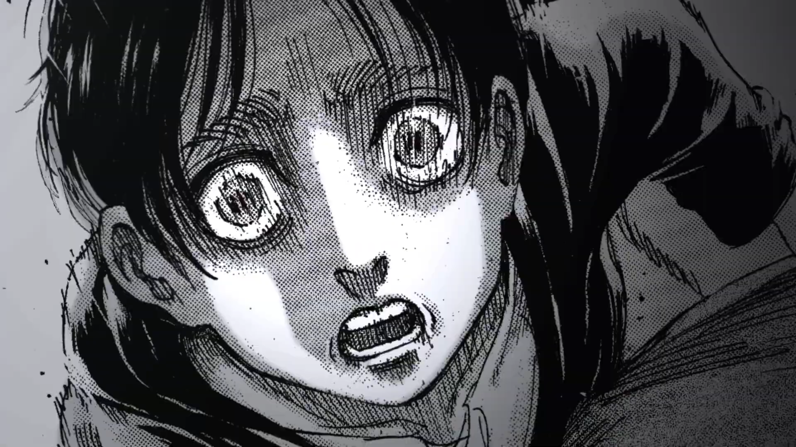
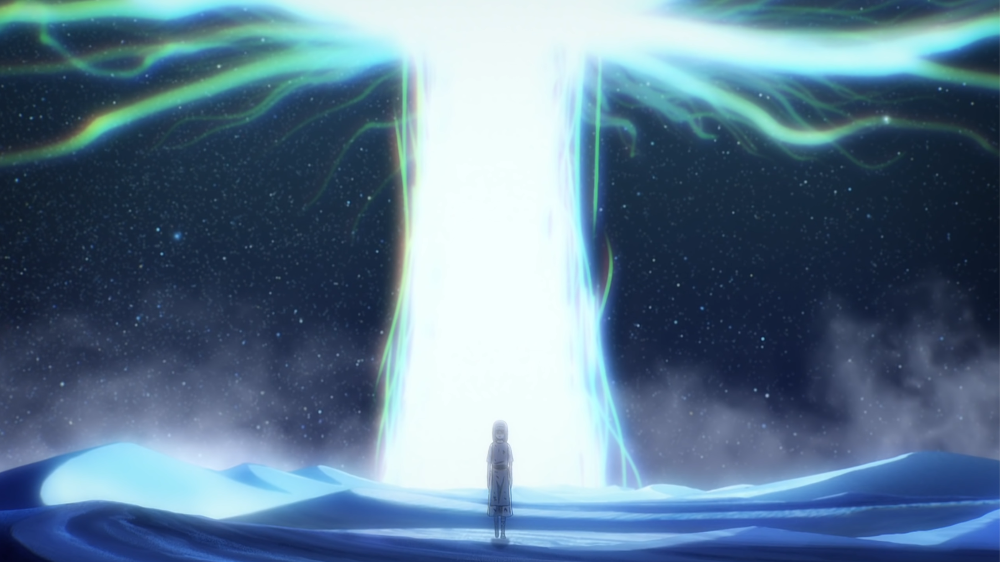

This is a spoiler-free rant on why you need to watch the anime Attack on Titan.

## Intro

I have been lucky enough to experience a couple things that were so wonderful it changed how I view the world.

One of those experiences was a sushi restaurant in Japan.

We had found a small sushi place that had four stars on google maps. The menu was just a $20 course and a $30 course and I ordered the $30 course. The chef handed each piece of sushi over the counter as he finished making them.



I didn't know it was possible for food to taste so good. Every bite was heaven. The flavor, the texture, the warmth -- it was all perfection.

Ever since, I can't help but feel scammed whenever I eat out (especially in the US). I still love good food, but nothing I've eaten has come close to that sushi.

Attack on Titan changed how I see storytelling in the same way that sushi store changed how I see food. I absolutely love Game of Thrones, Star Wars, Ender's Game, and Lord of the Rings, but Attack on Titan is on a different level.

I'll try to persuade you to watch Attack on Titan by shilling it's music, art, characters, and plot, and finally I'll explain how watching Attack on Titan made me a better person.

## Music

I'll start with this so that you can listen to the soundtrack while reading.

### Soundtrack

Attack on Titan's soundtrack goes so hard.

Here's a playlist of my favorites.
<iframe style="border-radius:12px" src="https://open.spotify.com/embed/playlist/2FmMhggKVcENQkG62EJvy4?utm_source=generator" width="100%" height="352" frameBorder="0" allowfullscreen="" allow="autoplay; clipboard-write; encrypted-media; fullscreen; picture-in-picture" loading="lazy"></iframe>

The epic symphonies with german vocals are iconic.



These songs hit much harder once you watch the show and you feel the nostalgia.

### Intros and Outros

Attack on Titan also commissions multiple unique intro and outro songs from famous Japanese bands for every season. These intros are paired with awesome animations that get you hyped for the episode. I like the diversity of music genres because it makes me appreciate styles of music that I ususally don't listen to (Red Swan, The Rumbling, Name of Love, etc).

<iframe style="border-radius:12px" src="https://open.spotify.com/embed/playlist/3JjKwDOv6DO6pENA3dYMl2?utm_source=generator" width="100%" height="152" frameBorder="0" allowfullscreen="" allow="autoplay; clipboard-write; encrypted-media; fullscreen; picture-in-picture" loading="lazy"></iframe>

## Art

### Manga

The Attack on Titan manga was written and illustrated all by one guy, Hajime Isayama. He started working on Attack on Titan when he was 19.

The following is one of the 33,000 hand-drawn manga panels. 

Attack on Titan is not a mass-produced TV show with the purpose of making as much money as possible. This is Isayama's life's work.

### Animation

The best animation studios in the world, WIT and MAPPA, worked with Isayama to create an anime that takes the manga to a different level.

Here are a few of my favorite nonspoiler shots. I love how they draw people's eyes (see the gallery in the next section) and the clouds.



Imagine watching a TV show where this much skill and care is put into *every scene*.

### Action

They have this technology called ODM Gear which is like [Titanfall 2 grapples](https://www.youtube.com/watch?v=U5lQGBl9rzg) on steroids. This, combined with epic titan-on-titan fights (choreographed with the help of professional martial artists), make Attack on Titan fight scenes super fun to watch. 

<a href="https://tenor.com/view/aot-levi-attack-on-titan-levi-ackerman-odm-gear-gif-25313040">Aot Levi GIF</a>from <a href="https://tenor.com/search/aot-gifs">Aot GIFs</a>
 

## Characters

Attack on Titan shows you war through the eyes of soldiers, civilians, oppressors and the oppressed. But instead of "good guys" and "bad guys," the characters are all written like real people that you can empathize with. As the story unfolds, you begin to understand the life and hopes and dreams of every character. The perspective of these incredibly well written characters helps you understand why people go to war and do terrible things. 

The art and voice acting convey the emotions of the characters. Here are some shots of my favorite characters.



If you watch the first episode you'll see the incredible voice acting I'm talking about.

## Plot

### Premise

The premise of Attack on Titan is that all of humanity is confined inside big walls, and there are man-eating giants, called titans, outside of the walls. Humanity struggles to fight for their freedom and to learn about the world.

I leave it at that because it's better if you learn the rest by watching the first episode.

### World Building

Every detail of the world of Attack on Titan has been thought out and is eventually explained. As the story progresses, you and the characters learn more and more about how the world works and its deep history. With every season, you realize the world of Attack on Titan was so much deeper than you thought it was.

### Plot Twists

Attack on Titan plot twists will dislocate your jaw. The tension build-up and cliffhangers will make you unable to stop watching and the twists will change your understanding of the whole story.

Isayama couldn't have written the first chapter of Attack on Titan without knowing how the whole story ended. The foreshadowing is brilliant, and despite how unpredictable the twists are, they make so much sense in hindsight.

### Ending

There isn't much I can say without spoiling, but the ending was truly incredible. I have never been more satisfied with how a story ended. All the characters and themes are tied together in a beautiful way.

## Message

Attack on Titan is a serious story. There is little to no comic relief. While the action is at times exciting, it is full of death, blood, and pain. It's impossible to tell a meaningful story about war without this. 

If you are in the mood for something casual and fun, I recommend One Punch Man instead. It's a hilarious anime about a desk worker becomes an absurdly powerful super hero and it has powerful themes about depression and what it really means to be a hero.

But watching a darker, more serious show like Attack on Titan is valuable because in addition to being enjoyable, it makes you understand and appreciate the world better. Watching Attack on Titan made me a better person. Here are the most important things I've learned from this story.

### The Meaning of Life

> "The world is merciless and also very beautiful"

Isayama shows the brutality of the world while also illustrating what makes humanity beautiful and worth protecting. 

> "In that moment, the thought entered my head… that maybe the reason I had been born was so that the three of us could run this race.”

Attack on Titan also depicts the value of the insignificant moments of peace and happiness that make life worth living.

### Freedom

> "Fiery water! Lands of ice! Sandy snowfields! Let's explore the outside world someday!"

> "If someone is willing to take away my freedom, I won't hesitate to take theirs."

Attack on Titan dives deep into the value and cost of freedom. What is freedom? Is it worth dying or killing for?

### War

> "It's us who give meaning to our comrades' lives! We die trusting the living who follow to find meaning in our lives! That is the sole method in which we can rebel against this cruel world!"

> "I never thought that being sent to my death would turn out to be so utterly meaningless in the end."

> "Do you see them? Our comrades? They want to know what became of the hearts they gave."

Why do people give up their lives for what they believe in? Even when they know their individual deaths would have a marginal impact? Attack on Titan shows you what it means to die for a cause and grapples with the morality of war.

### Cycle of Violence

> "The world is a great, big forest where everyone's fighting for their life. We gotta keep the younguns out of the forest. Otherwise... nothin's gonna stop it from happening again."

Attack on Titan depicts how revenge and greed lead to an endless cycle of violence. It shows how hard it is to escape this cycle and how we can move forward.

### Indoctrination

> "You were children who knew nothing but it was drilled into you. You were just kids. What could you even do?"

Attack on Titan shows you what indoctrination looks like and how it can make good people do terrible things. It illustrates how populations can be brainwashed and perpetuate ethnic hate.

## How to watch

### Streaming Site
I strongly recommend watching on Crunchyroll instead of sketchy sites like anime-update.com because the video, audio, and subtitle quality are much higher. Here's the [link](https://www.crunchyroll.com/watch/GR49GM4W6/to-you-2000-years-in-the-future--the-fall-of-zhiganshina-1) to the first episode (you can watch the first season on Crunchyroll for free).

### Watch with friends
I recommend watching Attack on Titan with friends or family. It's fun to talk about your favorite scenes, your favorite characters, the moral dilemmas, the plot twists, or the cliffhangers. There's a special bond that comes from experiencing a masterpiece together.

### Sub vs Dub
You should watch in Japanese with English subtitles because the Japanese voice actors are on a different level. You can really feel the difference even if you don't speak Japanese. Trust me.

## Conclusion

You need to watch Attack on Titan. What are you waiting for?

<iframe style="border-radius:12px" src="https://open.spotify.com/embed/track/4EZytiJfGIKolH85Nc6G8Q?utm_source=generator" width="100%" height="152" frameBorder="0" allowfullscreen="" allow="autoplay; clipboard-write; encrypted-media; fullscreen; picture-in-picture" loading="lazy"></iframe>